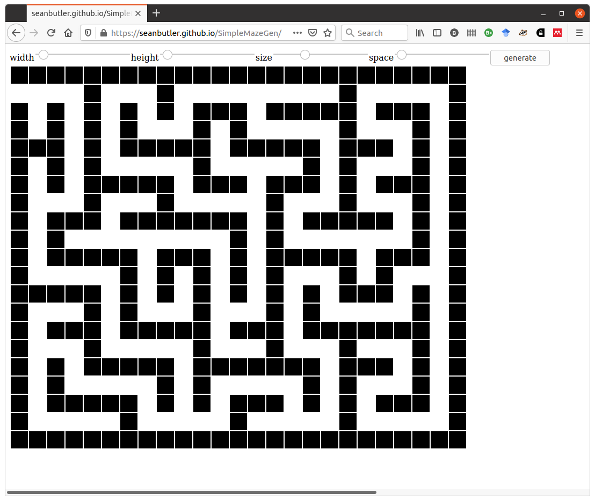

# SimpleMazeGen

Very simple open source maze generator in javascript.
Written to be easy to understand.

You should take it and use it in your own projects.

There is a working version here
https://seanbutler.github.io/SimpleMazeGen/

